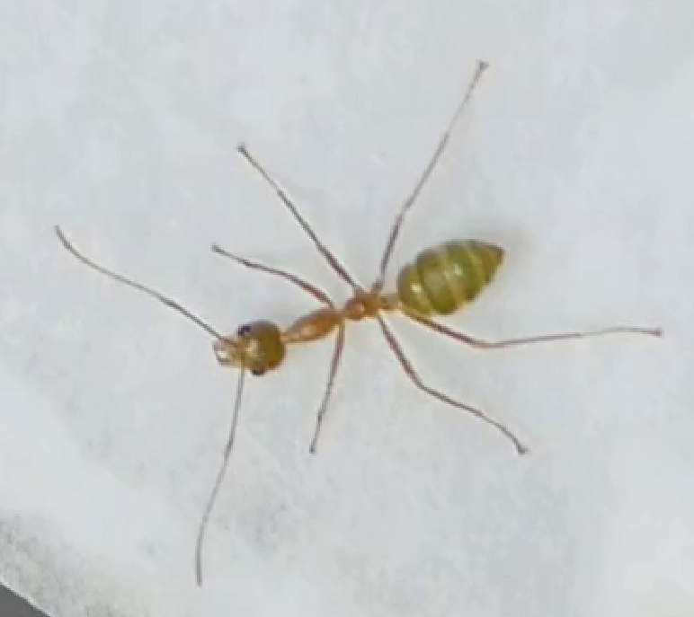
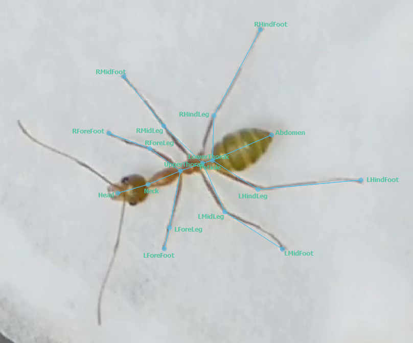

## Body part definitions
| Body part   | Definition/location                                                                            |
| ----------- | ---------------------------------------------------------------------------------------------- |
| Head        | front-most point on the head, between the mandibles (if they are visible)                      |
| Neck	      | point between the head and the front-most point of the thorax				       |
| UpperThorax | point between the first and second segments of the thorax                                      |
| LowerThorax | rear-most point on the second segment of the thorax where the hind legs are joined to the body |
| Petiole     | rear-most end of the segment joining the thorax to the gaster/front-most end of the gaster     |
| Abdomen     | rear-most point on the gaster                                                                  |
| LForeLeg    | knee joint of the front-most left leg                                                          |
| LForeFoot   | end of front-most left leg                                                                     |
| RForeLeg    | knee joint of the front-most right leg                                                         |
| RForeFoot   | end of front-most right leg                                                                    |
| LMidLeg     | knee joint of the middle left leg                                                              |
| LMidFoot    | end of middle left leg                                                                         |
| RMidLeg     | knee joint of the middle right leg                                                             |
| RMidFoot    | end of middle right leg                                                                        |
| LHindLeg    | knee joint of the rear-most left leg                                                           |
| LHindFoot   | end of rear-most left leg                                                                      |
| RHindLeg    | knee joint of the rear-most right leg                                                          |
| RHindFoot   | end of rear-most right leg                                                                     |

### Diagram

## Challenges
- Differentiating antennae from legs
- Distinguishing different legs from each other
  - Particularly when overlapping with self (self-grooming) and others
- Locating knees in straight-legged ants
